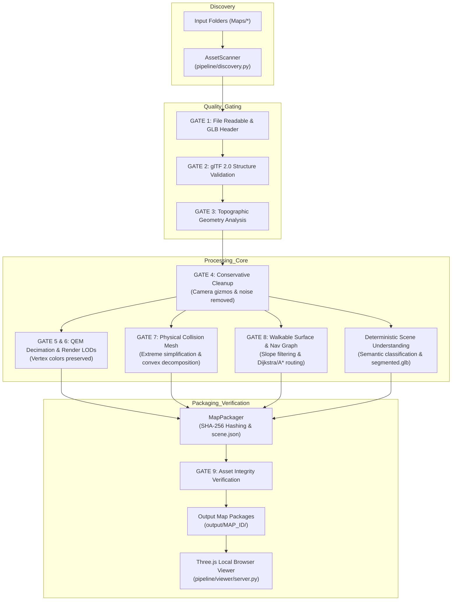

# System Architecture

The **3D Outdoor Map Processing Pipeline** is a modular, deterministic, headless system engineered for transforming raw/AI-reconstructed 3D outdoor environment models into game-ready visual and physical assets.

---

## High-Level Architecture Flow



---

## Directory & Component Layout

```
mapbuilder/
├── app/
│   ├── __init__.py
│   ├── __main__.py          # python -m app entrypoint
│   └── process.py           # Headless CLI entrypoint (scan, validate, process, etc.)
├── pipeline/
│   ├── __init__.py
│   ├── config.py            # Central dataclass configuration loader
│   ├── discovery.py         # Recursive scanner and SHA-256 inventory generator
│   ├── orchestrator.py      # Quality gate runner, self-healing loop, and caching
│   ├── validation/
│   │   ├── __init__.py
│   │   └── validator.py     # glTF 2.0 binary header, accessor, and topological validator
│   ├── analysis/
│   │   ├── __init__.py
│   │   └── analyzer.py      # Heights, bounding box, and normal slope distributions
│   ├── cleanup/
│   │   ├── __init__.py
│   │   └── cleaner.py       # Gizmo stripper, degenerate triangle remover, noise cleaner
│   ├── optimization/
│   │   ├── __init__.py
│   │   └── optimizer.py     # Fast QEM quadric decimation and LOD generation
│   ├── segmentation/
│   │   ├── __init__.py
│   │   └── segmenter.py     # Deterministic geometric scene classifier
│   ├── collision/
│   │   ├── __init__.py
│   │   └── generator.py     # Simplified physical collision mesh & convex hull bounds
│   ├── navigation/
│   │   ├── __init__.py
│   │   └── walkability.py   # Slope filtering & waypoint navigation graph builder
│   ├── export/
│   │   ├── __init__.py
│   │   └── packager.py      # Output file packager, SHA-256 calculator, scene.json
│   └── viewer/
│       ├── __init__.py
│       ├── server.py        # HTTP server with REST catalog and verify endpoints
│       └── templates/
│           └── viewer.html  # Three.js WebGL dashboard with layer toggles & live metrics
├── configs/
│   └── default_config.json  # Central tuning thresholds
├── scripts/
│   └── visual_verify.js     # Playwright WebGL visual verification and screenshots
├── tests/
│   ├── test_discovery.py
│   ├── test_validation.py
│   ├── test_analysis.py
│   ├── test_cleanup.py
│   ├── test_optimization.py
│   ├── test_collision.py
│   ├── test_walkability.py
│   ├── test_viewer_server.py
│   └── test_end_to_end.py
├── output/                  # Generated map outputs
├── reports/                 # Inventories, process reports, and visual screenshots
└── Maps/                    # Original input assets (never modified destructively)
```
