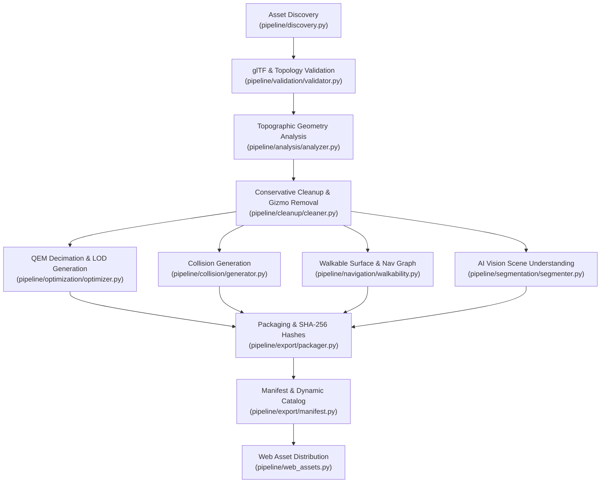

# Map Processing Pipeline Reference

Detailed reference guide for the offline map processing pipeline, algorithms, and thresholds.

---

## 1. Pipeline Stages

---

## 2. Threshold Configurations (`configs/default_config.json`)

- **Cleanup**:
  - `remove_camera_gizmos`: `true` (filters 14-vertex frustum nodes)
  - `remove_degenerate_faces`: `true` (filters zero area / duplicate indices)
  - `remove_isolated_components`: `true`
  - `min_component_faces`: `50`
  - `rebuild_normals`: `true`
- **Optimization Profiles**:
  - `high`: render ratio 0.75, max render faces 300,000
  - `medium`: render ratio 0.45, max render faces 150,000
  - `low`: render ratio 0.20, max render faces 50,000
- **Collision**:
  - `target_faces`: `3,000`
  - `method`: `"simplified_static_mesh_and_convex_hulls"`
- **Navigation & Walkability**:
  - `walkable_max_slope_deg`: `38.0`
  - `step_height_max`: `0.05`
  - `nav_graph_sample_points`: `500`
  - `nav_graph_connect_radius`: `0.08`
