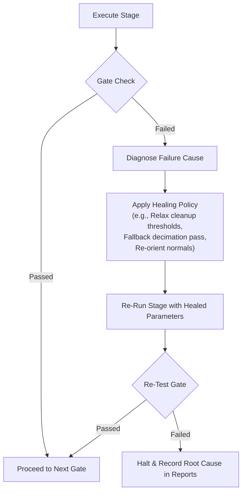

# Processing Pipeline & Quality Gates

This document explains every phase of the pipeline execution, how raw 3D meshes are sanitized, optimized, and packaged, and how the self-healing recovery loop operates.

---

## The 9 Quality Gates

Every map processed by the pipeline is subjected to nine sequential quality gates:

1. **GATE 1: File Readable**
   - Verifies that the source asset exists, is non-zero in size, and can be read by binary I/O.
   - Validates the initial 12-byte GLB header (`magic: b'glTF'`, `version: 2`, `length == file_size`).

2. **GATE 2: glTF Structure Valid**
   - Parses the JSON chunk using `pygltflib.GLTF2`.
   - Validates buffer views, accessor lengths, component types, node hierarchies, and mesh indices.
   - Checks for invalid cycle references or orphan mesh primitives.

3. **GATE 3: Geometry Analyzed**
   - Analyzes finite vertex values (ensures zero `NaN` or `Infinity` coordinates).
   - Computes bounding boxes, geometric extents, surface area, and convex hull volumes.
   - Computes vertical elevation profiles (min, max, median, p10, p25, p75, p90) and normal slope distributions.

4. **GATE 4: Cleanup & Gizmo Stripping**
   - Identifies non-world nodes (such as the 14-vertex camera frustum gizmos common in Gaussian Splatting / reconstruction exports).
   - Eliminates degenerate / zero-area triangles ($Area < 10^{-12}$).
   - Merges identical duplicate vertices while preserving vertex colors.
   - Filters out isolated micro-floating noise components (< 50 faces).
   - Recomputes smooth vertex normals and validates winding consistency.
   - Emits `cleaned/map_validated.glb` and `cleaned/map_clean.glb`.

5. **GATE 5: Optimization Successful**
   - Executes Garland-Heckbert Quadric Error Metric (QEM) simplification via C++ `fast-simplification`.
   - Transfers vertex colors (`COLOR_0`) to new vertices using a `scipy.spatial.cKDTree` nearest-neighbor interpolator.
   - Prepares multi-level Level-of-Detail models (LOD0 at target budget, LOD1 at 50%, LOD2 at 25%).

6. **GATE 6: Render Mesh Generated**
   - Validates that `optimized/render.glb` exists, is non-empty, contains valid vertices and normals, and can be loaded by Three.js / glTF loaders without errors.

7. **GATE 7: Collision Geometry Generated**
   - Generates an aggressive physical collision mesh (`collision/collision.glb`, target 2,500 - 6,000 faces, representing a 97-98% reduction from source).
   - Decomposes major structures into convex hulls and bounding boxes.
   - Encodes physical visual properties (translucent rust/orange material for easy debugging).

8. **GATE 8: Walkable Surface & Navigation**
   - Filters faces where the normal slope relative to vertical $\le 38^\circ$.
   - Strips elevated roof structures and isolated non-connected islands.
   - Emits `navigation/walkable.glb`.
   - Generates a topological waypoint graph (`navigation/nav_graph.json`) and verifies A* pathfinding.

9. **GATE 9: Browser Viewer Asset Check**
   - Programmatically verifies that all generated GLBs (`render.glb`, `collision.glb`, `walkable.glb`, `segmented.glb`) can be loaded concurrently over HTTP with valid MIME types (`model/gltf-binary`).

---

## The Self-Healing Recovery Loop

The pipeline implements an automated self-healing loop:
- **Case 1: Aggressive component pruning removes main mesh** -> Self-healing automatically reduces `min_component_faces` from 50 to 10 and retries.
- **Case 2: QEM simplification divergence** -> Self-healing falls back to a conservative un-decimated clean mesh and marks the gate as `HEALED`.
- **Case 3: Collision triangle count exceeds target** -> A secondary convergence pass decodes the intermediate mesh and tightens simplification down to target budget.
