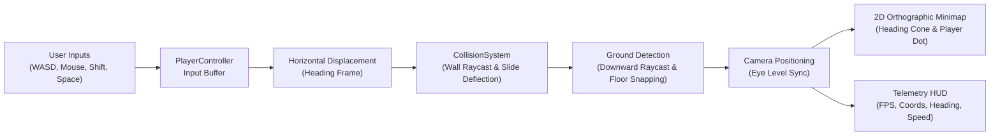

# First-Person POV Walker & Character Controller

This document details the architecture, kinematic equations, controls, and calibration of the browser-based 3D First-Person POV Walker.

---

## 1. Architecture Overview

The POV Walker transforms raw reconstructed 3D environments into an interactive, playable first-person game world directly inside the browser using Three.js and WebGL.

---

## 2. Controls & Keybindings

| Key / Action | Function | State Effect |
|---|---|---|
| **Mouse Look** | Controls Yaw & Pitch | Free camera orientation clamped to $\pm 85^\circ$ vertical angle |
| **`W` / `Up`** | Move Forward | Moves player in camera's horizontal heading direction |
| **`S` / `Down`** | Move Backward | Moves player backward |
| **`A` / `Left`** | Strafe Left | Horizontal strafe |
| **`D` / `Right`** | Strafe Right | Horizontal strafe |
| **`Shift` (Hold)** | Sprint | Multiplies base speed by $2.0\times$ |
| **`Space`** | Jump | Applies vertical impulse $v_y = v_{jump}$ when grounded |
| **`V`** | Toggle POV / Orbit | Switches between First-Person Walker and Aerial Orbit Camera |
| **`Tab`** | Developer Mode | Shows/hides layer inspection panel and live metrics |
| **`M`** | World Catalog | Opens modal to switch between maps (`map1`, `map2`, `map3`) |
| **`R`** | Safe Spawn Reset | Teleports player back to map's calculated safe spawn point |
| **`Esc`** | Release Cursor | Unlocks mouse pointer |

---

## 3. Kinematic Character Equations

### Horizontal Movement
$$\vec{v}_{intent} = (\Delta x \cdot \hat{x} + \Delta z \cdot \hat{z}) \cdot v_{speed}$$
$$\vec{v}_{world} = \mathbf{R}_{yaw} \cdot \vec{v}_{intent}$$

### Wall Deflection & Sliding
When moving into a wall obstacle with normal $\hat{n}_{wall}$:
$$\vec{v}_{slide} = \vec{v}_{world} - (\vec{v}_{world} \cdot \hat{n}_{wall}) \hat{n}_{wall}$$

### Ground Snapping & Gravity
1. Downward raycast from $\vec{p} + [0, h_{step} + 0.05, 0]$ with direction $[0, -1, 0]$.
2. If ray hits ground at height $y_{hit}$:
   $$\Delta y = y_{hit} - p_y$$
   If $\Delta y \le h_{step}$ and normal angle $\theta \le \theta_{max}$ ($45^\circ$):
   $$p_y = y_{hit}, \quad v_y = 0, \quad \text{grounded} = \text{true}$$
3. If no ground detected:
   $$v_y(t + \Delta t) = v_y(t) - g \cdot \Delta t$$
   $$p_y(t + \Delta t) = p_y(t) + v_y \cdot \Delta t, \quad \text{grounded} = \text{false}$$

---

## 4. Map Scale Calibration

Reconstructed meshes from Gaussian Splatting / photogrammetry have variable scales (e.g. `map1` extents are $0.55m \times 0.30m \times 0.52m$). The controller automatically scales kinematic parameters based on the map's vertical extents:

$$\text{scale} = \text{clamp}\left(\frac{\text{extent}_y}{0.35}, 0.4, 2.5\right)$$
- $\text{height} = 0.16 \cdot \text{scale}$
- $\text{eyeHeight} = 0.14 \cdot \text{scale}$
- $\text{radius} = 0.03 \cdot \text{scale}$
- $\text{walkSpeed} = 0.35 \cdot \text{scale}$
- $\text{gravity} = 3.2 \cdot \text{scale}$
